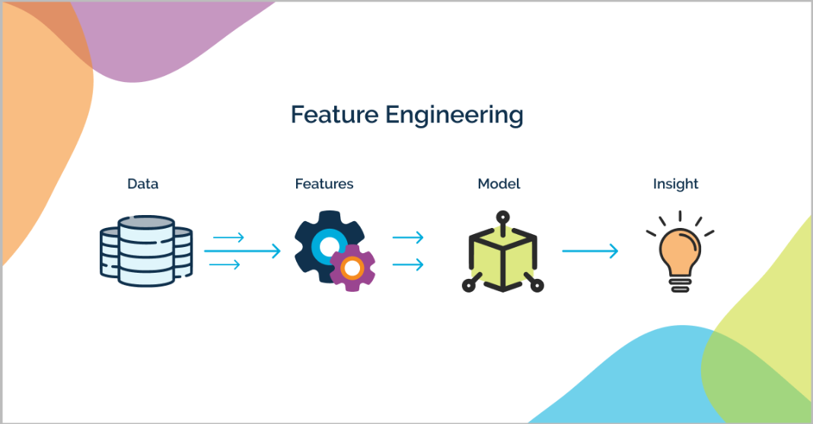

## Feature Engineering

### What is Feature Engineering?

Feature Engineering is the process of transforming raw data into meaningful features that can improve the performance of machine learning models. It involves creating, modifying, and optimizing features (variables) that represent the underlying data in ways that machine learning algorithms can easily understand and learn from.

In the context of data science, good features often play a more critical role than the choice of algorithms themselves. Without proper feature engineering, even the most advanced machine learning models will struggle to produce meaningful results. This process typically involves a combination of domain knowledge, exploratory data analysis, and iterative experimentation to extract and prepare the most relevant information from raw data.

### Importance of Feature Engineering

Machine learning models rely heavily on the quality of input data. The more representative and clean the features, the better the model can generalize to new data. Poor features can lead to inaccurate predictions, even when using powerful models. By carefully engineering features, you can improve model performance, reduce overfitting, and make the model more interpretable.

### Key Techniques in Feature Engineering

1. **Handling Missing Data:**
   Missing data can pose significant challenges to machine learning models. Feature engineering involves dealing with missing values through various techniques, such as:
   - Imputation (filling missing values with the mean, median, or mode).
   - Forward and backward filling for time series data.
   - Predictive methods using models like k-Nearest Neighbors (KNN) imputation.

2. **Encoding Categorical Variables:**
   Many machine learning algorithms require numerical inputs, so categorical features need to be converted into numerical representations:
   - **One-Hot Encoding:** Converts categorical variables into binary columns for each category.
   - **Label Encoding:** Assigns a unique numerical value to each category.
   - **Target Encoding:** Uses the mean of the target variable for each category.

3. **Scaling and Normalization:**
   Feature scaling ensures that numerical features have similar ranges, which is important for models sensitive to the magnitude of features like k-NN or gradient descent-based algorithms:
   - **Standardization:** Transforms data to have zero mean and unit variance.
   - **Normalization:** Scales values into a specific range, typically between 0 and 1.

4. **Creating Interaction Features:**
   Interaction features are new features generated by combining two or more existing features. For example:
   - **Polynomial Features:** Creating features like the product, square, or cube of existing features.
   - **Cross-Feature Interactions:** Capturing the relationship between different features.

5. **Feature Selection and Dimensionality Reduction:**
   In high-dimensional datasets, not all features contribute equally to model performance. Feature selection or dimensionality reduction techniques help reduce the number of features by:
   - **Removing irrelevant or redundant features** that don’t improve the model’s accuracy.
   - **Principal Component Analysis (PCA):** Reducing dimensionality by projecting the data onto orthogonal components that capture the most variance.
   - **L1/Lasso Regularization:** Automatically eliminating non-contributing features during model training.

6. **Date and Time Features:**
   For datasets involving time, extracting features from date and time stamps can add valuable information. Examples include:
   - Extracting day, month, year, hour, minute, etc.
   - Calculating time deltas between events.
   - Identifying patterns based on seasons, weekends, or holidays.

7. **Text Features:**
   When working with textual data, feature engineering techniques can include:
   - **Tokenization:** Splitting text into words or n-grams.
   - **TF-IDF (Term Frequency-Inverse Document Frequency):** Converting text into a numerical matrix based on word frequency.
   - **Word Embeddings:** Representing words in a continuous vector space (e.g., Word2Vec, GloVe).

8. **Feature Transformation:**
   Transforming features to better fit the assumptions of the model can include:
   - **Log Transformations:** Reducing skewness in positively skewed distributions.
   - **Box-Cox Transformations:** Applying a power transformation to make data more normal-like.

### Benefits of Feature Engineering

- **Improved Model Performance:** Well-engineered features can significantly enhance the accuracy and efficiency of machine learning models.
- **Better Interpretability:** Carefully chosen features allow for easier interpretation of the model’s predictions.
- **Reduced Overfitting:** By selecting the most relevant features, the model can avoid fitting noise in the data.
- **Increased Model Flexibility:** New features can help capture complex patterns in data that may not be evident with the raw input.

### Example of a Feature Engineering Pipeline

Below is a simplified example of a feature engineering pipeline:

1. **Raw Data Collection:** Collecting the original dataset, which often contains missing values, categorical variables, outliers, and other noisy data.
2. **Data Cleaning:** Handling missing values, removing duplicates, and fixing inconsistencies.
3. **Feature Transformation:** Applying transformations to normalize or scale features and create new interaction features.
4. **Feature Selection:** Identifying the most relevant features for the model, using techniques like correlation analysis or feature importance.
5. **Final Dataset:** A clean, enriched dataset that is ready for use in machine learning models.

### Conclusion

Feature engineering is an iterative and creative process that requires both domain expertise and an understanding of machine learning. It’s often said that "better data beats better algorithms," and feature engineering is where this adage holds true. By crafting high-quality features, we provide the model with more informative data, leading to improved performance and more insightful results.
